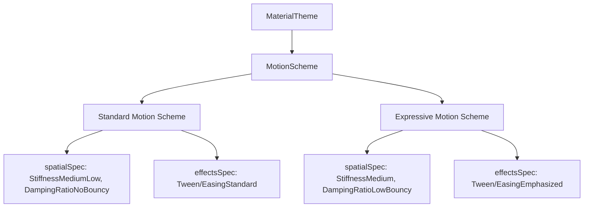

# Material 3 Motion Design System & TypeScript Architecture

This document outlines the research, technical specifications, and TypeScript
architecture for implementing the **Material 3 Motion System** within the React
Material3 Expressive component library.

---

## 1. M3 Motion Principles

Material 3 motion makes user interfaces feel alive, responsive, and intuitive.
It relies on three key tenets:

1. **Responsive:** Fast-acting and adapts to the user’s interactions, providing
   immediate feedback.
2. **Expressive:** Adds character, style, and premium branding using stylized
   easing curves and subtle elastic transitions.
3. **Physics-Based (Expressive M3):** Prefers dynamic physics-based springs for
   spatial movements over rigid durations and bezier curves.

---

## 2. Technical Specifications: Easing and Durations

### 2.1 Easing Curves (Timing Functions)

Easing curves define the rate of change over a transition's duration. In web
applications, these map directly to `transition-timing-function` (`cubic-bezier`
values).

| Token Name                                   | Cubic-Bezier Coordinates            | Intended Use / Behavioral Profile                                                                                          |
| :------------------------------------------- | :---------------------------------- | :------------------------------------------------------------------------------------------------------------------------- |
| `md.sys.motion.easing.emphasized`            | `cubic-bezier(0.2, 0.0, 0, 1.0)`    | **Default/Core Curve.** Recommended for most standard transitions (expansions, tab switches). Fallback to Standard in CSS. |
| `md.sys.motion.easing.emphasized.decelerate` | `cubic-bezier(0.05, 0.7, 0.1, 1.0)` | **Incoming/Enter Curve.** Fast deceleration, perfect for elements appearing or entering the viewport.                      |
| `md.sys.motion.easing.emphasized.accelerate` | `cubic-bezier(0.3, 0.0, 0.8, 0.15)` | **Outgoing/Exit Curve.** Fast acceleration, ideal for elements exiting the screen permanently.                             |
| `md.sys.motion.easing.standard`              | `cubic-bezier(0.2, 0.0, 0, 1.0)`    | **Utility Curve.** Used for small, focused transitions (e.g., checkboxes, switches, sliders).                              |
| `md.sys.motion.easing.standard.decelerate`   | `cubic-bezier(0.0, 0.0, 0.0, 1.0)`  | **Utility Enter.** Standard deceleration curve for smaller elements entering.                                              |
| `md.sys.motion.easing.standard.accelerate`   | `cubic-bezier(0.3, 0.0, 1.0, 1.0)`  | **Utility Exit.** Standard acceleration curve for smaller elements exiting.                                                |

#### Legacy & Utility Curves

- **Linear:** `cubic-bezier(0, 0, 1, 1)` (continuous, linear rate of change).
- **M2 Standard (Legacy):** `cubic-bezier(0.4, 0, 0.2, 1)`
- **M2 Decelerate (Legacy):** `cubic-bezier(0, 0, 0.2, 1)`
- **M2 Accelerate (Legacy):** `cubic-bezier(0.4, 0, 1, 1)`

---

### 2.2 Duration Tokens

Duration tokens represent the speed of transitions. They are grouped into four
categories, each with four hierarchical levels of speed.

| Duration Group | Token Name   | Value (ms) | CSS Format | Recommended Use Cases                             |
| :------------- | :----------- | :--------- | :--------- | :------------------------------------------------ |
| **Short**      | `short1`     | `50ms`     | `50ms`     | Micro-interactions, state layers, hover effects.  |
|                | `short2`     | `100ms`    | `100ms`    | Simple switches, small icons, toggle selections.  |
|                | `short3`     | `150ms`    | `150ms`    | Sliders, checkboxes, simple text highlights.      |
|                | `short4`     | `200ms`    | `200ms`    | Tooltips, menu appear/disappear.                  |
| **Medium**     | `medium1`    | `250ms`    | `250ms`    | Standard buttons, chip transitions, simple lists. |
|                | `medium2`    | `300ms`    | `300ms`    | Bottom sheets, FABs, small cards expanding.       |
|                | `medium3`    | `350ms`    | `350ms`    | Standard dialogs, drawer transitions.             |
|                | `medium4`    | `400ms`    | `400ms`    | Larger, multi-step complex component transitions. |
| **Long**       | `long1`      | `450ms`    | `450ms`    | Page navigations, major structural changes.       |
|                | `long2`      | `500ms`    | `500ms`    | Screen-wide layout expansions, hero animations.   |
|                | `long3`      | `550ms`    | `550ms`    | Highly visual structural morphs.                  |
|                | `long4`      | `600ms`    | `600ms`    | Immersive media viewers, full screen transitions. |
| **Extra Long** | `extraLong1` | `700ms`    | `700ms`    | Slow cinematic or dramatic transitions.           |
|                | `extraLong2` | `800ms`    | `800ms`    | Large modal dialog morphs.                        |
|                | `extraLong3` | `900ms`    | `900ms`    | Full screen carousel switches.                    |
|                | `extraLong4` | `1000ms`   | `1000ms`   | Multi-step complex visual walkthroughs.           |

---

## 3. Reference: Android Jetpack Compose M3 Motion

In Android Jetpack Compose Material 3 (v1.3.0+), motion has moved from hardcoded
curves to a dual **Motion Profile Scheme** powered by spring physics.



### Jetpack Compose Architecture Details

1. **`MotionScheme` Interface:** Exposes predefined animation specifications
   (`AnimationSpec`) for components.
   - `spatialSpec`: Used for spatial or physical size/position changes.
   - `effectsSpec`: Used for structural color, fading, or alpha effect changes.
2. **Profiles:**
   - **Standard Profile (`StandardMotionTokens`):** High utility, direct, low
     bouncy. Spatial is `spring(dampingRatio = 0.9f, stiffness = 1500f)`,
     effects are standard timing curves.
   - **Expressive Profile (`ExpressiveMotionTokens`):** Stylized, high brand
     energy. Spatial is a bouncy spring
     `spring(dampingRatio = 0.75f, stiffness = 1000f)` for elastic feel, effects
     are emphasized timing curves.

---

## 4. TypeScript Design & Implementation for Web

To bring Jetpack Compose's elegance and M3 specifications to React (web), we
define a comprehensive TypeScript API inside `/lib/src/motion/`. Since our
design demands **Inline Styles Only** and **Theme Object Integrations**, our
architecture represents motion in CSS-friendly values (seconds/milliseconds and
cubic-bezier string representations) while offering full profile switching
capability.

### 4.1 Interface Definitions (`types.ts`)

```typescript
/**
 * Easing Curves represented as CSS Cubic-Bezier values
 */
export interface EasingTokens {
  emphasized: string;
  emphasizedDecelerate: string;
  emphasizedAccelerate: string;
  standard: string;
  standardDecelerate: string;
  standardAccelerate: string;
  linear: string;
}

/**
 * Duration levels in both raw numbers (ms) and ready-to-use CSS strings.
 */
export interface DurationLevel {
  ms: number;
  css: string;
}

export interface DurationTokens {
  short1: DurationLevel;
  short2: DurationLevel;
  short3: DurationLevel;
  short4: DurationLevel;
  medium1: DurationLevel;
  medium2: DurationLevel;
  medium3: DurationLevel;
  medium4: DurationLevel;
  long1: DurationLevel;
  long2: DurationLevel;
  long3: DurationLevel;
  long4: DurationLevel;
  extraLong1: DurationLevel;
  extraLong2: DurationLevel;
  extraLong3: DurationLevel;
  extraLong4: DurationLevel;
}

/**
 * An individual component transition specification
 */
export interface TransitionSpec {
  duration: string;
  easing: string;
  transitionString: (properties: string[]) => string;
}

/**
 * Jetpack Compose-inspired Motion Scheme for Web.
 * Decouples spatial transitions (moves, expansions) from alpha/fade effects.
 */
export interface MotionScheme {
  spatial: TransitionSpec;
  effects: TransitionSpec;
  utility: TransitionSpec;
}

/**
 * Full System-level Motion Tokens
 */
export interface MotionTokens {
  easing: EasingTokens;
  duration: DurationTokens;
  schemes: {
    standard: MotionScheme;
    expressive: MotionScheme;
  };
}
```

---

### 4.2 Core Value Implementations (`constants.ts`)

```typescript
import {
  DurationTokens,
  EasingTokens,
  MotionScheme,
  MotionTokens,
} from "./types.ts";

export const M3Easing: EasingTokens = {
  emphasized: "cubic-bezier(0.2, 0, 0, 1)",
  emphasizedDecelerate: "cubic-bezier(0.05, 0.7, 0.1, 1)",
  emphasizedAccelerate: "cubic-bezier(0.3, 0, 0.8, 0.15)",
  standard: "cubic-bezier(0.2, 0, 0, 1)",
  standardDecelerate: "cubic-bezier(0, 0, 0, 1)",
  standardAccelerate: "cubic-bezier(0.3, 0, 1, 1)",
  linear: "cubic-bezier(0, 0, 1, 1)",
};

export const M3Duration: DurationTokens = {
  short1: { ms: 50, css: "50ms" },
  short2: { ms: 100, css: "100ms" },
  short3: { ms: 150, css: "150ms" },
  short4: { ms: 200, css: "200ms" },
  medium1: { ms: 250, css: "250ms" },
  medium2: { ms: 300, css: "300ms" },
  medium3: { ms: 350, css: "350ms" },
  medium4: { ms: 400, css: "400ms" },
  long1: { ms: 450, css: "450ms" },
  long2: { ms: 500, css: "500ms" },
  long3: { ms: 550, css: "550ms" },
  long4: { ms: 600, css: "600ms" },
  extraLong1: { ms: 700, css: "700ms" },
  extraLong2: { ms: 800, css: "800ms" },
  extraLong3: { ms: 900, css: "900ms" },
  extraLong4: { ms: 1000, css: "1000ms" },
};

// Helper to create a TransitionSpec string generator
const createSpec = (duration: string, easing: string) => ({
  duration,
  easing,
  transitionString: (properties: string[] = ["all"]) =>
    properties.map((prop) => `${prop} ${duration} ${easing}`).join(", "),
});

export const StandardMotionScheme: MotionScheme = {
  spatial: createSpec(M3Duration.medium4.css, M3Easing.standard), // 400ms Precise
  effects: createSpec(M3Duration.medium1.css, M3Easing.standard), // 250ms Snappy
  utility: createSpec(M3Duration.short2.css, M3Easing.linear), // 100ms Linear
};

export const ExpressiveMotionScheme: MotionScheme = {
  spatial: createSpec(M3Duration.long2.css, M3Easing.emphasized), // 500ms Rich/Bouncy
  effects: createSpec(M3Duration.medium2.css, M3Easing.emphasized), // 300ms Smooth
  utility: createSpec(M3Duration.short3.css, M3Easing.standard), // 150ms Standard
};

export const motion: MotionTokens = {
  easing: M3Easing,
  duration: M3Duration,
  schemes: {
    standard: StandardMotionScheme,
    expressive: ExpressiveMotionScheme,
  },
};
```

---

## 5. Integration into React Theme System

To achieve the requirement of the central **Theme Object**, we will embed the
`motion` tokens inside the main global `MaterialTheme` context.

### 5.1 Centralized Theme Interface

```typescript
import { ColorScheme } from "../colors/types.ts";
import { TypographyScheme } from "../typography/types.ts";
import { ShapeScheme } from "../shapes/types.ts";
import { ElevationScheme } from "../elevation/types.ts";
import { MotionScheme, MotionTokens } from "./types.ts";

export interface MaterialTheme {
  colors: ColorScheme;
  typography: TypographyScheme;
  shapes: ShapeScheme;
  elevation: ElevationScheme;
  motion: MotionTokens;
  activeMotionScheme: MotionScheme; // Easily toggle global expressive/standard profile
}
```

---

## 6. React Component Usage Examples

Here is how our components will consume the motion system via **Inline Styles
Only**.

### 6.1 Example 1: Expandable Card (Spatial Transition)

This component animates its width, height, and position using the `spatial`
motion transition specification.

```tsx
import React, { useState } from "react";
import { useTheme } from "../../theme/useTheme.ts"; // Custom theme hook

export function ExpandableCard() {
  const { theme } = useTheme();
  const [expanded, setExpanded] = useState(false);

  // Consume the global spatial motion scheme
  const motionStyle = {
    transitionProperty: "width, height, transform",
    transitionDuration: theme.activeMotionScheme.spatial.duration,
    transitionTimingFunction: theme.activeMotionScheme.spatial.easing,
  };

  const cardStyle = {
    ...motionStyle,
    width: expanded ? "400px" : "200px",
    height: expanded ? "300px" : "150px",
    backgroundColor: theme.colors.surface,
    borderRadius: theme.shapes.large,
    border: `1px solid ${theme.colors.outline}`,
    cursor: "pointer",
  };

  return (
    <div style={cardStyle} onClick={() => setExpanded(!expanded)}>
      <h3 style={{ margin: 16, color: theme.colors.onSurface }}>
        Click to Morph
      </h3>
    </div>
  );
}
```

### 6.2 Example 2: Snappy Button Hover & Focus (Utility & Effects Transition)

A standard button uses the snappy utility spec for mouse-over state changes and
opacity fades.

```tsx
import React, { useState } from "react";
import { useTheme } from "../../theme/useTheme.ts";

export function StandardButton({ children }: { children: React.ReactNode }) {
  const { theme } = useTheme();
  const [isHovered, setIsHovered] = useState(false);

  // Generates the full transition string using helper
  const transitionStyle = {
    transition: theme.activeMotionScheme.effects.transitionString([
      "background-color",
      "opacity",
      "box-shadow",
    ]),
  };

  const buttonStyle = {
    ...transitionStyle,
    padding: "10px 24px",
    border: "none",
    borderRadius: theme.shapes.full,
    backgroundColor: isHovered
      ? theme.colors.primaryHover
      : theme.colors.primary,
    color: theme.colors.onPrimary,
    cursor: "pointer",
  };

  return (
    <button
      style={buttonStyle}
      onMouseEnter={() => setIsHovered(true)}
      onMouseLeave={() => setIsHovered(false)}
    >
      {children}
    </button>
  );
}
```

---

## 7. Proposed Tasks for Implementation Phase

When authorized to start implementation, we will execute the following:

1. **Create files inside `/lib/src/motion/`**:
   - `types.ts`: Define `EasingTokens`, `DurationTokens`, `TransitionSpec`,
     `MotionScheme`, `MotionTokens`.
   - `constants.ts`: Define easing curves, durations, standard and expressive
     profiles.
   - `mod.ts`: Re-export typing declarations and motion token constants.
2. **Unit Tests in `/test/motion/`**:
   - Verify all constants exist and match specifications.
   - Test that the `transitionString` generator correctly formats transition
     strings.
3. **Integrate into global `MaterialTheme`**:
   - Update standard theme context files to inherit the new motion
     configuration.
4. **Sandbox/Playground Visuals**:
   - Add a playground showcase page validating both `Standard` and `Expressive`
     motion schemes side-by-side for expandable shapes, lists, and modals to
     verify smooth HMR and premium aesthetic alignment.
